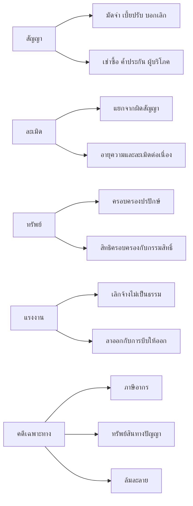
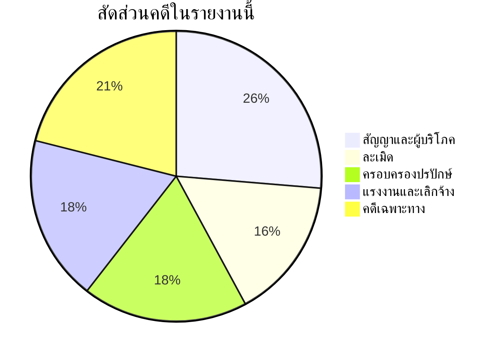

<!-- ───────────── METADATA ───────────── -->
ชื่อกฎหมาย/เอกสาร : คำพิพากษาฎีกาที่เป็นบรรทัดฐาน
หมวดในคลัง       : 05_dika
ระดับคุณภาพ       : B
แหล่งที่มา        : รายงานวิเคราะห์ฎีกา (เขียนขึ้น มีเครื่องหมาย citeturn และ mermaid)
ปรับปรุงล่าสุด     : ไม่ระบุ
หมายเหตุ          : รายงานวิเคราะห์ — ผู้เขียนเองระบุว่าอ้างจาก DEKA.in.th ในหลายคดี ต้องตรวจกับฐานทางการก่อนใช้ในคำคู่ความ
<!-- ──────────────────────────────────── -->

# รายงานวิเคราะห์คำพิพากษาฎีกาที่เป็นบรรทัดฐานสำหรับทนายความไทย

## บทสรุปผู้บริหาร

รายงานนี้คัดเลือกและจัดหมวดคำพิพากษาศาลฎีกาที่ควรถือเป็น “บรรทัดฐานใช้งานจริง” สำหรับทนายความไทย โดยเน้นหมวดที่ผู้ใช้ร้องขอเป็นหลัก ได้แก่ ผิดสัญญา ละเมิด ครอบครองปรปักษ์ และเลิกจ้าง พร้อมขยายไปยังคดีผู้บริโภค ภาษีอากร ทรัพย์สินทางปัญญา การค้าระหว่างประเทศ และล้มละลาย ซึ่งศาลฎีกามีการจัดทำหน้ารวมคำพิพากษาและแผนกคดีชำนัญพิเศษไว้โดยตรงบนเว็บไซต์ทางการ รวมทั้งมีระบบ “สืบค้นฎีกา 2015” เป็นฐานค้นกลางของศาลยุติธรรมด้วย citeturn16search8turn36search0turn14search1turn14search3turn17search6

ภาพรวมของบรรทัดฐานที่พบมีแกนหลักอยู่ที่การ “แยกฐานสิทธิให้ถูกก่อนฟ้อง” กล่าวคือ คดีสัญญาต้องแยกจากคดีละเมิดให้ชัด, คดีครอบครองปรปักษ์ต้องพิสูจน์ว่าเป็นการยึดถือ “ทรัพย์ของผู้อื่น” จริง, คดีแรงงานต้องแยกระหว่าง “ลาออก” กับ “เลิกจ้าง” จากพฤติการณ์โดยรวม, ส่วนคดีเช่าซื้อและคดีผู้บริโภคต้องอ่านเงื่อนไขการคืนทรัพย์ การบอกเลิก และการทวงถามผู้ค้ำอย่างเคร่งครัด มิฉะนั้นสิทธิเรียกค่าขาดราคาอาจหล่นหายได้ทันที citeturn3search17turn25view4turn39search0turn18search3turn23search2

ในเชิงปฏิบัติ คดีชุดสัญญาและผู้บริโภคชี้ชัดว่าศาลให้ความสำคัญกับเจตนาคู่สัญญาและความได้สัดส่วนของเบี้ยปรับอย่างมาก; คดีละเมิดยืนหลักว่าไม่ใช่ทุกการผิดสัญญาจะกลายเป็นละเมิด และหัวค่าเสียหายต้องเป็นผลโดยตรง; คดีครอบครองปรปักษ์เน้นความแตกต่างระหว่างสิทธิครอบครองกับกรรมสิทธิ์; คดีแรงงานใช้มาตรฐานข้อเท็จจริงเชิงพฤติการณ์มากกว่าฉลากที่นายจ้างตั้งให้; คดีภาษีอากรวางมาตรฐานหลักฐานทางบัญชีและภาษีซื้ออย่างเข้มงวด; ส่วนคดีล้มละลายและอนุญาโตตุลาการเตือนทนายให้ระวัง “ขอบเขตอำนาจ” และ “ผลของคำสั่งพิทักษ์ทรัพย์” เป็นพิเศษ citeturn21view1turn3search11turn25view1turn38search1turn31search1turn34search0turn14search4

ข้อจำกัดสำคัญของการค้นครั้งนี้คือ ฐานข้อมูลทางการของศาลฎีกาเปิดให้เข้าถึงได้ในระดับ “หน้าสรุป/หน้าคดีเด่น/หน้าหมวด” บางส่วน และบางหน้ามีปัญหา timeout หรือเปิดไม่ได้ในเวลาค้นจริง ขณะที่ DEKA.in.th เข้าถึงคำพิพากษาย่อสั้นจำนวนมากกว่าแต่ไม่ใช่เว็บไซต์ราชการ แม้หลายหน้าจะระบุแหล่งที่มาเป็นกองผู้ช่วยผู้พิพากษาศาลฎีกา สำนักงานส่งเสริมงานตุลาการ หรือเนติบัณฑิตยสภาก็ตาม นอกจากนี้ ฐานสาธารณะของศาลฎีกาไม่แสดง “citation count” โดยตรง; บางหน้าภายนอกระบบมีเพียงจำนวนดาวน์โหลดหรือประวัติการเปิด ซึ่งไม่ใช่จำนวนครั้งถูกอ้างอิง จึงไม่ควรใช้แทนกัน citeturn10view2turn22view0turn11search9turn21view1turn16search4turn16search7

## ขอบเขต วิธีวิจัย และข้อจำกัด

การคัดเลือกคดีในรายงานนี้ใช้หลักสามชั้น ได้แก่ แหล่งทางการของศาลฎีกาและเว็บไซต์หน่วยงานรัฐเป็นฐานหลัก, แหล่งสรุปคำพิพากษาเฉพาะทางของกรมสวัสดิการและคุ้มครองแรงงานกับกรมสรรพากรเป็นฐานเสริมสำหรับคดีแรงงานและภาษีอากร, และใช้ DEKA.in.th เป็นฐานสำรองสำหรับคดีแพ่ง/ละเมิด/ทรัพย์สินรุ่นเก่าที่หน้าเว็บไซต์ทางการเปิดไม่เสถียรในรอบค้นนี้ โดยเลือกเฉพาะคดีที่วางหลักกฎหมายซ้ำได้ในงานว่าความจริง ไม่ใช่คดีเฉพาะข้อเท็จจริงอย่างเดียว citeturn16search8turn29search1turn31search1turn11search9

ศาลฎีกาเผยแพร่เนื้อหาแยกตามแผนกคดีชำนัญพิเศษหลายประเภท เช่น แรงงาน ผู้บริโภค ภาษีอากร ทรัพย์สินทางปัญญาและการค้าระหว่างประเทศ ล้มละลาย เยาวชนและครอบครัว และแผนกคดีอาญาของผู้ดำรงตำแหน่งทางการเมือง รายงานนี้จึงรวมคดีเฉพาะทางไว้ในหมวดที่สัมพันธ์กับการใช้งานของทนายความคดีแพ่งและพาณิชย์มากที่สุด โดยไม่ได้ลงลึกในหมวดเยาวชน ครอบครัว การเมือง หรือยาเสพติด เพราะอยู่นอกแกนคำถามหลัก citeturn36search0turn36search1turn36search3turn36search10

แผนภาพต่อไปนี้สรุปความสัมพันธ์ของประเด็นกฎหมายในชุดคดีที่คัดเลือก

กราฟนี้เป็น “สถิติของชุดคดีที่คัดเลือกในรายงานนี้” ไม่ใช่สถิติการอ้างอิงของทั้งระบบคำพิพากษา

ในส่วน “จำนวนครั้งที่ถูกอ้างอิง” ผู้จัดทำไม่พบดัชนี citation สาธารณะของศาลฎีกาที่นับการอ้างคำพิพากษาแบบฐานข้อมูลวิชาการ จึงระบุสถานะไว้เป็น “ไม่ปรากฏดัชนีสาธารณะ” สำหรับทุกคดี เว้นแต่บางหน้าของศาลยุติธรรมส่วนภูมิภาคจะแสดงเพียงจำนวนดาวน์โหลดเอกสาร และบางหน้าของระบบกลางจะแสดงประวัติการเปิดคดี ซึ่งเป็นคนละตัวชี้วัดกับจำนวนครั้งถูกอ้างอิงในคำพิพากษาอื่น ๆ citeturn16search4turn16search7turn16search8

## หมวดสัญญาและคดีผู้บริโภค

ตารางนี้รวมคดีสัญญาทั่วไปและคดีผู้บริโภค/เช่าซื้อที่ใช้เป็นแนวอ้างอิงบ่อยในงานว่าความแพ่งเชิงพาณิชย์ โดยคอลัมน์ “หลักวินิจฉัยและเหตุผลย่อ” รวมทั้งประเด็นกฎหมาย สาระสำคัญ และเหตุผลของคำพิพากษาไว้ในช่องเดียวเพื่อให้อ่านเปรียบเทียบได้รวดเร็ว

| คดี/ปี | ศาล/แผนก | ประเด็นกฎหมาย | หลักวินิจฉัยและเหตุผลย่อ | ผลกระทบเชิงปฏิบัติสำหรับทนายความ | แหล่งต้นฉบับ/ลิงก์ |
|---|---|---|---|---|---|
| 1324/2538 | ศาลฎีกา | เงินมัดจำเป็นสาระสำคัญของสัญญาจะซื้อจะขาย | เช็คมัดจำใช้เงินไม่ได้ทำให้ผู้จะซื้อวางมัดจำไม่ครบตามหนังสือสัญญา; ศาลถือว่าคู่สัญญากำหนดให้การชำระมัดจำครบเป็นสาระสำคัญ; ผู้ขายจึงบอกเลิกและริบมัดจำได้ทันทีโดยไม่ต้องบอกกล่าวให้ชำระภายในกำหนดเวลาอีก | ฝ่ายผู้ขายควรร่างเงื่อนไขมัดจำและสิทธิบอกเลิกให้ชัด; ฝ่ายผู้ซื้อควรหลีกเลี่ยงการส่งเช็คที่เสี่ยงถูกปฏิเสธ | DEKA.in.th citeturn21view0 |
| 6595/2544 | ศาลฎีกา | การลดเบี้ยปรับที่สูงเกินส่วน | ค่าปรับตามสัญญาเป็นเบี้ยปรับตาม ป.พ.พ. มาตรา 383; แม้ลูกหนี้เคยยอมรับว่าจะจ่าย ศาลยังลดได้หากสูงเกินส่วน; ต้องพิจารณาเทียบกับความเสียหายจริงและพฤติการณ์แห่งคดี | หากเป็นโจทก์ ต้องพิสูจน์ความเสียหายจริงให้มากที่สุด; หากเป็นจำเลย ต้องยกประเด็น proportionality และพฤติการณ์ลดหย่อน | DEKA.in.th ระบุแหล่งที่มาสำนักงานส่งเสริมงานตุลาการ citeturn21view1 |
| 7392/2543 | ศาลฎีกา | ผู้จะขายยังไม่มีกรรมสิทธิ์ในทรัพย์ แต่สัญญาจะซื้อจะขายยังผูกพันได้ | สัญญาจะซื้อจะขายทรัพย์ที่จะโอนในภายหน้าใช้บังคับได้ แม้ผู้จะขายยังไม่มีกรรมสิทธิ์; เมื่อโอนให้ไม่ได้ภายในกำหนด ผู้จะซื้อบอกเลิกได้; ศาลให้คืนมัดจำและชำระเบี้ยปรับ | ใช้ในคดีซื้อขายที่ดินรวบรวม/โครงการและการตรวจสอบ title due diligence; แยกสัญญานายหน้าออกจากสัญญาจะซื้อจะขายให้ชัด | DEKA.in.th citeturn21view2 |
| 1504/2542 | ศาลฎีกา | การโอนทรัพย์ให้บุคคลอื่นภายหลังและผลของการฟ้องคดี | คดีก่อนที่แพ้เพราะบอกเลิกไม่ชอบไม่ตัดสิทธิฟ้องคดีใหม่ที่อาศัยเหตุใหม่; การโอนที่ดินให้ผู้อื่นทำให้การชำระหนี้ตกเป็นพ้นวิสัยเพราะฝ่ายจำเลย; การฟ้องคดีมีผลเป็นการเลิกสัญญาตามมาตรา 389 ในตัว | ใช้กำหนด “cause of action” ใหม่เมื่อมีเหตุผิดสัญญาเกิดภายหลัง; ช่วยวางฟอร์มคำขอคืนมัดจำ เบี้ยปรับ และดอกเบี้ย | DEKA.in.th citeturn21view3 |
| 3180/2541 | ศาลฎีกา | ค่าปรับรายวันกับค่าเสียหายหลังบอกเลิกในสัญญาจ้างก่อสร้าง | สิทธิเรียกค่าปรับรายวันกับสิทธิบอกเลิกสัญญาและเรียกค่าเสียหายเป็นสิทธิคนละส่วน ใช้ร่วมกันได้หากสงวนสิทธิไว้; แต่ศาลอาจลดเบี้ยปรับหากความล่าช้ามีส่วนเกิดจากโจทก์เอง | ใช้ในคดีก่อสร้าง/จัดซื้อจัดจ้าง; ต้องเก็บหลักฐานหนังสือสงวนสิทธิและแยกสาเหตุความล่าช้าของแต่ละฝ่าย | DEKA.in.th citeturn21view4 |
| 1203/2565 | ศาลฎีกาแผนกคดีผู้บริโภค | ผู้เช่าซื้อนำรถคืนโดยยังไม่ผิดนัด ต้องรับผิดค่าขาดราคาหรือไม่ | เมื่อผู้เช่าซื้อคืนรถในขณะที่ไม่มีค่างวดถึงกำหนดค้างและไม่มีหนี้อื่นตามสัญญา การคืนรถถือเป็นการใช้สิทธิบอกเลิกสัญญา; ผู้เช่าซื้อจึงไม่ต้องรับผิดค่าขาดราคา | ฝ่ายผู้เช่าซื้อควรพิสูจน์ว่าก่อนคืนทรัพย์ไม่มียอดค้าง; ฝ่ายผู้ให้เช่าซื้อต้องแยกให้ชัดว่าเป็นคืนทรัพย์เพราะผิดนัดหรือคืนทรัพย์เพื่อเลิกสัญญา | ศาลฎีกา + แหล่งสรุปข้อเท็จจริงเพิ่มเติม citeturn18search3turn41search1turn41search8 |
| 4995/2562 | ศาลฎีกาแผนกคดีผู้บริโภค | ผู้ค้ำประกันในเช่าซื้อหลุดพ้นเพราะไม่ได้มีหนังสือทวงถามใน 60 วัน | เจ้าหนี้ที่ไม่ทวงถามผู้ค้ำประกันภายในกำหนดเวลาตามกฎหมายหลังลูกหนี้ผิดนัด ย่อมเรียกผู้ค้ำในส่วนค่าขาดราคาไม่ได้ | ใช้เป็นข้อต่อสู้ชั้นต้นทันที; ต้องตรวจวันผิดนัด วันทวงถาม และรูปแบบหนังสืออย่างละเอียด | ศาลฎีกา citeturn18search1turn23search2turn36search11 |
| 3252/2566 | ศาลฎีกาแผนกคดีผู้บริโภค | การเลิกสัญญาเช่าซื้อโดยการส่งมอบทรัพย์ แม้ยังทำตามเงื่อนไขไม่ครบทุกข้อ | ศาลดูพฤติการณ์โดยรวมและความเข้าใจได้ของคู่สัญญา ไม่ยึดรูปแบบอย่างเดียว; ถ้าการส่งมอบทรัพย์สะท้อนเจตนาเลิกสัญญาชัด ก็อาจถือว่าเลิกสัญญาได้ | ทนายต้องเก็บหลักฐานการมอบคืนรถ การรับมอบ และการติดต่อสื่อสารทุกฉบับ เพื่อพิสูจน์ “objective intent” | ศาลฎีกา citeturn18search6 |
| 1455/2562 | ศาลฎีกาแผนกคดีผู้บริโภค | ค่าเสียหายเชิงลงโทษในคดีสินค้าไม่ปลอดภัย | การฟ้องคดีผู้บริโภคใช้รูปแบบคำฟ้องยืดหยุ่น แต่การจะได้ค่าเสียหายเชิงลงโทษต้องพิสูจน์เจตนาเอาเปรียบโดยไม่เป็นธรรม หรือจงใจ/ประมาทเลินเล่ออย่างร้ายแรง; ไม่ใช่ได้โดยอัตโนมัติ | ฝ่ายโจทก์ต้องชี้องค์ประกอบของ punitive damages ให้ครบ; ฝ่ายจำเลยควรหักล้างเรื่องเจตนาและความร้ายแรงของความประมาท | ศาลฎีกา + แหล่งอธิบายเพิ่มเติม citeturn18search10turn35search1turn35search5 |
| 13071/2558 | ศาลฎีกาแผนกคดีผู้บริโภค | ผู้เช่าซื้อยังมีส่วนได้เสียในรถที่เอาประกันภัย แม้มีการขายต่อโดยยังไม่ได้รับความยินยอมจากผู้ให้เช่าซื้อ | การโอนสิทธิการเช่าซื้อโดยไม่ชอบไม่ผูกพันผู้ให้เช่าซื้อเดิม; ผู้เช่าซื้อเดิมจึงยังมีภาระและผลประโยชน์ในรถ และยังมีอำนาจฟ้องบริษัทประกันเมื่อรถสูญหาย | ใช้ในคดีประกันภัยรถเช่าซื้อและคดีซ้อนหลายสัญญา; อย่าดูแต่ชื่อผู้ครอบครองหรือทะเบียน ต้องดู “economic interest” และความรับผิดตามสัญญาเดิม | ศาลฎีกา + แหล่งสรุปข้อเท็จจริงเพิ่มเติม citeturn18search8turn35search2turn35search6 |

จำนวนครั้งที่ถูกอ้างอิงของคดีในตารางนี้ไม่ปรากฏบนฐานสาธารณะของศาลฎีกา; ในทางปฏิบัติให้ใช้ “น้ำหนักของหลักกฎหมาย” และสถานะเป็นคดีเด่น/คดีชำนัญพิเศษแทนการนับ citation count citeturn16search4turn16search7turn16search8

ภาพรวมของหมวดนี้ชี้ว่าศาลให้ความสำคัญกับสามเรื่องมากที่สุด คือ เจตนาที่แสดงในหนังสือสัญญา, ความได้สัดส่วนของเบี้ยปรับ, และลำดับขั้นตอนก่อน-หลังการคืนทรัพย์ในเช่าซื้อ หากทนายจัดลำดับเอกสารไม่ดี เช่น หนังสือสงวนสิทธิ หนังสือบอกเลิก หลักฐานค่างวด และหลักฐานการรับคืนทรัพย์ ผลคดีอาจกลับได้แม้ข้อเท็จจริงเชิงเศรษฐกิจใกล้เคียงกันมาก citeturn21view0turn21view1turn21view4turn18search3turn18search6

## หมวดละเมิดและความรับผิด

| คดี/ปี | ศาล/แผนก | ประเด็นกฎหมาย | หลักวินิจฉัยและเหตุผลย่อ | ผลกระทบเชิงปฏิบัติสำหรับทนายความ | แหล่งต้นฉบับ/ลิงก์ |
|---|---|---|---|---|---|
| 400/2546 | ศาลฎีกา | ผิดสัญญากับละเมิดต่างกันอย่างไร | การผิดสัญญาโดยตัวมันเองยังไม่เป็นละเมิด เว้นแต่มีการกระทำผิดกฎหมายหรือละเมิดสิทธิที่แยกต่างหากจากความผูกพันตามสัญญา | ก่อนฟ้องต้องเลือกฐานสิทธิให้ถูก เพราะกระทบอายุความ ภาระพิสูจน์ และหัวค่าเสียหายที่เรียกได้ | ศาลฎีกา citeturn3search17 |
| 2569/2540 | ศาลฎีกา | ผลของสัญญาประนีประนอมยอมความกับผู้ร่วมทำละเมิดต่อความรับผิดของนายจ้าง | เมื่อผู้เสียหายทำสัญญาประนีประนอมยอมความในมูลละเมิดกับลูกจ้างผู้ร่วมทำละเมิด หนี้มูลละเมิดในส่วนที่ผูกโยงกับนายจ้างย่อมระงับไปตามหลักความรับผิดร่วม | ในการเจรจา settlement ต้องกำหนดให้ชัดว่าประสงค์สงวนสิทธิฟ้องผู้ร่วมรับผิดรายอื่นหรือไม่ | ศาลฎีกา citeturn3search13 |
| 6933/2540 | ศาลฎีกา | ละเมิดต่อเนื่องกับอายุความ 1 ปี | ความเสียหายจากการก่อสร้างที่ยังดำเนินต่อเนื่องถือเป็นละเมิดต่อเนื่อง; ยังไม่นับอายุความตั้งแต่งานบางช่วงเสร็จ; เริ่มนับเมื่อการกระทำก่อให้เกิดความเสียหายสิ้นสุดและผู้เสียหายรู้ตัวผู้รับผิด | สำคัญมากในคดีเพื่อนบ้าน อาคารชุด งานฐานราก เสาเข็ม รอยร้าว และมลภาวะจากงานก่อสร้าง | DEKA.in.th ระบุแหล่งกองผู้ช่วยผู้พิพากษาศาลฎีกา citeturn28view0 |
| 5220/2539 | ศาลฎีกา | ค่าเสียหายในอนาคตและดอกเบี้ยในคดีละเมิด | ผู้เสียหายที่ทุพพลภาพเรียกค่ารักษา ค่าใช้จ่ายอนาคต ค่าจ้างผู้ช่วย/คนขับ ค่าเสียความสามารถประกอบอาชีพ และค่าทุกข์ทรมานได้; แม้เรียกเป็นเงินก้อนรวมถึงอนาคต ดอกเบี้ยนับแต่วันละเมิดได้ | ควรใช้พยานแพทย์ นักเศรษฐศาสตร์ หรือเอกสารประเมินค่าใช้จ่ายระยะยาวเพื่อทำตารางความเสียหาย | DEKA.in.th citeturn28view1 |
| 404/2555 | ศาลฎีกา | ค่าทนายความและค่าป่วยการในคดีอาญาเป็นค่าเสียหายละเมิดได้หรือไม่ | ค่าใช้จ่ายดังกล่าวไม่ใช่ผลโดยตรงของการละเมิด แต่เป็นค่าใช้จ่ายในการดำเนินคดีที่เกิดภายหลัง ผู้ทำละเมิดจึงไม่ต้องรับผิดในฐานะค่าสินไหมทดแทน | อย่าฟ้อง “หัวค่าเสียหาย” เกินที่กฎหมายรองรับ; ควรแยกต้นทุนคดีออกจากความเสียหายโดยตรง | ศาลฎีกา citeturn3search11 |
| 7471/2556 | ศาลฎีกา | ห้างสรรพสินค้าต้องรับผิดเพราะรถลูกค้าสูญหายในลานจอดหรือไม่ | ห้างมีหน้าที่ดูแลความปลอดภัยของลูกค้าในชีวิตและทรัพย์สิน; การติดป้ายไม่รับผิดฝ่ายเดียวไม่ตัดความรับผิดในละเมิด; การยกเลิกระบบบัตรจอดรถและใช้กล้องแทนจนคุมการเข้าออกไม่ได้เป็นฐานแห่งความประมาท | ใช้บ่อยในคดีความปลอดภัยในสถานประกอบการ โรงแรม โรงพยาบาล และลานจอดรถเอกชน | DEKA.in.th citeturn28view3 |

หมวดละเมิดสอนทนายอย่างน้อยสองเรื่องสำคัญ คือ หนึ่ง ต้องไม่แปลงคดีผิดสัญญาให้เป็นละเมิดโดยอัตโนมัติ และสอง หัวค่าเสียหายต้องเป็นผล “โดยตรง” ตาม causal chain ไม่ใช่ค่าใช้จ่ายที่คู่ความเลือกแบกรับเองภายหลัง เช่น ค่าทนายหรือค่าใช้จ่ายเชิงกลยุทธ์ในการดำเนินคดีอาญา citeturn3search17turn3search11

## หมวดทรัพย์และครอบครองปรปักษ์

| คดี/ปี | ศาล/แผนก | ประเด็นกฎหมาย | หลักวินิจฉัยและเหตุผลย่อ | ผลกระทบเชิงปฏิบัติสำหรับทนายความ | แหล่งต้นฉบับ/ลิงก์ |
|---|---|---|---|---|---|
| 5023/2550 | ศาลฎีกา | จะอ้างครอบครองปรปักษ์ในทรัพย์ของตนเองได้หรือไม่ | การครอบครองปรปักษ์เกิดได้เฉพาะทรัพย์ที่เป็นกรรมสิทธิ์ของผู้อื่น; หากผู้ฟ้องยืนยันมาตลอดว่าตนเป็นเจ้าของอยู่แล้ว ย่อมอ้างครอบครองปรปักษ์ไม่ได้; ศาลยกฟ้องได้ตั้งแต่ชั้นตรวจคำฟ้อง | ระวังการวางคำฟ้องอย่าอ้างฐานสิทธิขัดกันเอง ระหว่าง “เป็นเจ้าของเดิม” กับ “ได้กรรมสิทธิ์โดยปรปักษ์” | DEKA.in.th ระบุแหล่งเนติบัณฑิตยสภา citeturn25view4 |
| 3095/2552 | ศาลฎีกา | น.ส.3 ก. กับการนับเวลาเพื่อได้กรรมสิทธิ์โดยครอบครองปรปักษ์ | ที่ดินที่มีเพียง น.ส.3 ก. ทำให้ผู้ครอบครองมีเพียงสิทธิครอบครอง; จะนับระยะเวลาเพื่อได้กรรมสิทธิ์โดยปรปักษ์ได้ต่อเมื่อที่ดินออกโฉนดแล้ว และนับจากวันออกโฉนด | คดีที่ดินเปลี่ยนมือจากเอกสารสิทธิชั้นต่ำไปเป็นโฉนด ต้องแยก “เวลาแห่งสิทธิครอบครอง” ออกจาก “เวลาแห่งกรรมสิทธิ์” | DEKA.in.th citeturn25view1 |
| 2627/2542 | ศาลฎีกา | ทายาทคนหนึ่งครอบครองที่ดินมรดกยาวนาน จะได้ปรปักษ์ต่อทายาทอื่นหรือไม่ | การครอบครองที่ดินมรดกที่ยังไม่แบ่งกันโดยทายาทคนหนึ่ง ถือเป็นการครอบครองแทนทายาททั้งปวง; ต้องมีการแสดงเจตนาเปลี่ยนลักษณะการยึดถืออย่างชัดแจ้งต่อทายาทอื่นเสียก่อนจึงจะเริ่มปรปักษ์ได้ | ใช้เป็นแนวหลักในคดีพี่น้องแย่งที่ดินมรดก; ต้องหาหลักฐานการปฏิเสธสิทธิหรือขับไล่อย่างชัดเจน | DEKA.in.th citeturn25view0 |
| 2902/2535 | ศาลฎีกา | รูปแบบคำร้องขอแสดงกรรมสิทธิ์โดยครอบครองปรปักษ์ | หากขอทั้งแปลงโฉนด ไม่จำต้องระบุเนื้อที่ ความกว้างยาว หรือแนบสำเนาโฉนดซ้ำให้ละเอียดทุกมิติ; หากยังไม่มีผู้โต้แย้งสิทธิ การดำเนินคดีโดยคำร้องย่อมทำได้ | ช่วยให้ทนายวางรูปคดีได้ถูกว่าจะยื่น “คำร้อง” หรือ “คำฟ้อง” และลดการถูกโต้แย้งเรื่องเคลือบคลุม | DEKA.in.th citeturn25view2 |
| 1021/2538 | ศาลฎีกา | การแย่งการครอบครองกับการบอกกล่าวเปลี่ยนลักษณะการยึดถือ | หากผู้ครอบครองไม่ได้อยู่โดยอาศัยสิทธิของโจทก์ แต่เข้ายึดถือในลักษณะแย่งการครอบครอง ก็ไม่ต้องบอกกล่าวเปลี่ยนลักษณะการยึดถือไปยังเจ้าของเดิม; แต่ไม่ได้หมายความว่าจะบังคับให้เจ้าของจดทะเบียนแบ่งแยกที่ดินให้เสมอไป | ใช้แยกคดี “อยู่โดยวิสาสะ/อาศัยสิทธิ” ออกจากคดี “เข้าแย่งการครอบครอง”; สำคัญต่อภาระพิสูจน์เจตนาเป็นเจ้าของ | DEKA.in.th citeturn25view3 |
| 1355-1357/2539 | ศาลฎีกา | ถ้าให้การว่าเป็นที่มรดกตนเองอยู่แล้ว จะเกิดประเด็นปรปักษ์หรือไม่ | เมื่อจำเลยต่อสู้ว่าที่ดินเป็นมรดกตกทอดของตนอยู่แล้ว การครอบครองย่อมไม่ใช่การครอบครองทรัพย์ของผู้อื่น; ประเด็นเรื่องปรปักษ์จึงอยู่นอกคำให้การ และ ส.ค.1 ไม่ใช่หลักฐานกรรมสิทธิ์เหนือโฉนด | อย่าเผลอต่อสู้สองทางที่หักล้างกันเอง; เลือก strategy ให้สอดคล้องกับฐานสิทธิ | DEKA.in.th / สรุปจากคำพิพากษา citeturn26search5turn26search3 |
| 4607/2540 | ศาลฎีกา | หลักเดียวกับคดี 1355-1357/2539 และได้รับน้ำหนักจากประชุมใหญ่ | ศาลย้ำในคดีประชุมใหญ่ว่า หากจำเลยอ้างว่าทำการบนที่ดินของตนเอง ก็ไม่เกิดประเด็นปรปักษ์ในที่ดินของผู้อื่น; น้ำหนักบรรทัดฐานจึงสูงในทางปฏิบัติ | ควรอ้างร่วมกับคดี 1355-1357/2539 เมื่อโต้แย้งเรื่องกรอบประเด็นในคำให้การและ burden of pleading | DEKA.in.th สรุปย่อ + ระบุว่าเป็นประชุมใหญ่ครั้งที่ 6/2540 citeturn26search1 |

แกนร่วมของคดีครอบครองปรปักษ์คือ ศาลเคร่งมากในเรื่อง “ฐานการยึดถือ” และ “เจ้าของเดิมเป็นใคร” ถ้าคู่ความพูดเองว่าที่ดินเป็นของตนโดยมรดก ซื้อมา หรือครอบครองแทนผู้อื่นอยู่ก่อน มักทำให้คดีปรปักษ์พังตั้งแต่ระดับการกำหนดประเด็นแล้ว ไม่ใช่แพ้เพราะนับเวลาไม่ได้อย่างเดียว citeturn25view0turn25view1turn26search5turn26search1

## หมวดแรงงานและการเลิกจ้าง

| คดี/ปี | ศาล/แผนก | ประเด็นกฎหมาย | หลักวินิจฉัยและเหตุผลย่อ | ผลกระทบเชิงปฏิบัติสำหรับทนายความ | แหล่งต้นฉบับ/ลิงก์ |
|---|---|---|---|---|---|
| 7189/2562 | ศาลฎีกาแผนกคดีแรงงาน | ความผิดของลูกจ้างกับเกณฑ์เลิกจ้างที่เป็นธรรม | คดีนี้ศาลฎีกานำมาเป็นคดีเด่นเรื่องการรักษาความลับของนายจ้างจากการส่งข้อมูลลับเข้าอีเมลส่วนตัว; หลักสำคัญคือการกระทำผิดของลูกจ้างไม่ใช่ทุกกรณีจะร้ายแรงถึงขั้นเลิกจ้างได้อย่างเป็นธรรม และการสอบสวนทางวินัยไม่ใช่เรื่องเดียวกับการประเมินความเป็นธรรมของการเลิกจ้าง | ฝ่ายนายจ้างต้องพิสูจน์ระดับความร้ายแรง กระทบต่อธุรกิจ และเหตุผลความสมควรของโทษ; ฝ่ายลูกจ้างต้องแยกโจมตีเรื่อง “fairness of dismissal” ออกจาก “disciplinary process” | ศาลฎีกา citeturn29search0turn12search7turn40search2 |
| 991/2560 | ศาลฎีกาแผนกคดีแรงงาน | อายุงานต่อเนื่องและค่าจ้างสองส่วน | เมื่อนายจ้างไทยรับโอนลูกจ้างมาจากบริษัทแม่โดยตกลงนับอายุงานต่อเนื่อง ต้องนับอายุงานรวม; ค่าจ้างที่จ่ายสองส่วนต้องนำมาคำนวณค่าชดเชยด้วย | ใช้บ่อยในคดีโอนธุรกิจ M&A และ expatriate structure; ตรวจสัญญาโอนตัวลูกจ้าง หนังสือ HR และ pay structure ให้ครบ | กรมสวัสดิการและคุ้มครองแรงงาน citeturn29search1turn29search5 |
| 3248/2560 | ศาลฎีกาแผนกคดีแรงงาน | ลาออกโดยสมัครใจกับการถูกบังคับออก | เมื่อนายจ้างให้เวลาลูกจ้างคิดไตร่ตรองและลูกจ้างลงชื่อในใบลาออกเอง ศาลถือว่าเป็นการลาออกโดยสมัครใจ ไม่ใช่การเลิกจ้าง | ฝ่ายลูกจ้างต้องหักล้างองค์ประกอบ “ความสมัครใจ” ด้วยข้อเท็จจริงเรื่องแรงกดดัน เวลา และบริบท; ฝ่ายนายจ้างต้องเก็บหลักฐานว่ามีช่วงเวลาพิจารณาเพียงพอ | กรมสวัสดิการและคุ้มครองแรงงาน พร้อมไฟล์ PDF citeturn39search0turn29search2 |
| 3578/2561 | ศาลฎีกาแผนกคดีแรงงาน | ลงชื่อใบลาออกหลังมีข้อกล่าวหาวินัย | คดีเด่นนี้ชี้ว่าลูกจ้างที่มีพฤติการณ์ไม่เหมาะสมและลงลายมือชื่อในใบลาออกภายหลัง โดยศาลล่างรับฟังว่าไม่ถูกบีบบังคับ ย่อมเป็นเรื่องลาออก ไม่ใช่เลิกจ้าง; อุทธรณ์ที่โต้ข้อเท็จจริงล้วน ๆ ศาลฎีกาไม่รับวินิจฉัย | ต้องประเมินตั้งแต่แรกว่าประเด็นที่จะฎีกาเป็นข้อกฎหมายจริงหรือเป็นเพียงการโต้ดุลพินิจการรับฟังพยาน | กรมสวัสดิการและคุ้มครองแรงงาน + คำอธิบายข่าวคดี citeturn39search4turn39search5 |
| 6367/2560 | ศาลฎีกาแผนกคดีแรงงาน | กรรมการผู้จัดการเป็นลูกจ้างหรือไม่ | กรมสวัสดิการและคุ้มครองแรงงานนำคดีนี้ขึ้นเป็น “เกร็ดความรู้คู่แรงงาน” โดยยืนยันหลักว่า กรรมการผู้จัดการซึ่งมีฐานะเป็นผู้แทนนิติบุคคลและใช้อำนาจบริหารในระดับนั้น อาจไม่อยู่ในฐานะลูกจ้างตามกฎหมายแรงงาน | เป็นคดีสำคัญในกิจการครอบครัว บริษัท startup และข้อพิพาทกับ executives; ต้องอ่านข้อบังคับบริษัท อำนาจลงนาม และโครงสร้างอำนาจจริง | กรมสวัสดิการและคุ้มครองแรงงาน citeturn39search2turn37search0 |
| 7393/2562 | ศาลฎีกาแผนกคดีแรงงาน | ไม่มีงานให้ทำ ส่งกลับบ้านไม่มีกำหนด เป็นเลิกจ้างหรือไม่ | เมื่อนายจ้างไม่มีงานให้ลูกจ้างทำ สั่งให้ไปรองานที่บ้านโดยไม่มีกำหนดแน่นอน และไม่จ่ายค่าจ้าง พฤติการณ์ย่อมแสดงว่าไม่ประสงค์ให้ทำงานต่อ จึงเป็นการเลิกจ้างตามกฎหมาย | ใช้ได้ดีกับคดีพักงานแฝง การ “ดองพนักงาน” และการปิดกิจการแบบไม่ออกหนังสือ; ต้องพิสูจน์พฤติการณ์รวม ไม่ใช่เพียงถ้อยคำในคำสั่ง | กรมสวัสดิการและคุ้มครองแรงงาน citeturn38search1turn38search3 |
| 3114/2567 | ศาลฎีกาแผนกคดีแรงงาน | ทำงานต่อหลังเกษียณ เป็นสัญญาใหม่หรือขยายอายุเกษียณ | แนวล่าสุดของกรมสวัสดิการและคุ้มครองแรงงานสรุปคดีนี้ว่า การให้ลูกจ้างทำงานต่อหลังครบเกษียณอายุอาจเป็นการขยายระยะเวลาเกษียณ ไม่ใช่การทำสัญญาจ้างใหม่ ส่งผลต่อการนับอายุงานและสิทธิค่าชดเชย | ต้องตรวจเอกสาร HR หลังเกษียณ คู่มือพนักงาน และการตกลงเฉพาะราย; มีผลโดยตรงต่อ claims เรื่องค่าชดเชย | กรมสวัสดิการและคุ้มครองแรงงาน citeturn30search2turn40search3turn40search6 |

หมวดแรงงานจึงสรุปเป็นสูตรง่ายได้ว่า ศาลดู “ความเป็นจริงของนิติสัมพันธ์และพฤติการณ์เลิกจ้าง” มากกว่าป้ายชื่อที่นายจ้างติดให้เอกสาร หากมีใบลาออกแต่พฤติการณ์จริงคือไล่ออก คดีก็ยังกลับได้; หากมีคำสั่งให้รออยู่บ้านโดยไม่มีกำหนดและไม่จ่ายค่าจ้าง ศาลก็อาจถือว่าเป็นการเลิกจ้างแล้วแม้ไม่มีหนังสือ termination โดยตรง citeturn39search0turn38search1turn29search0

## หมวดคดีเฉพาะทางและข้อเสนอแนะสำหรับทนายความ

### คดีเฉพาะทางที่ควรรวมไว้ในชุดอ้างอิงประจำโต๊ะทำงาน

| คดี/ปี | ศาล/แผนก | ประเด็นกฎหมาย | หลักวินิจฉัยและเหตุผลย่อ | ผลกระทบเชิงปฏิบัติสำหรับทนายความ | แหล่งต้นฉบับ/ลิงก์ |
|---|---|---|---|---|---|
| 3071/2531 | ศาลฎีกาแผนกคดีภาษีอากร | รายจ่ายต้องห้ามตาม ม.65 ตรี (18) | ใบรับเงินที่ไม่ระบุชื่อตัวผู้รับ นามสกุล หรือที่อยู่ชัดเจน ทำให้พิสูจน์ไม่ได้ว่าใครเป็นผู้รับเงิน รายจ่ายจึงหักไม่ได้ | ในคดีภาษีรายจ่าย หัวใจคือ chain of evidence ของผู้รับเงินจริง ไม่ใช่แค่ลงบัญชีไว้ | กรมสรรพากร citeturn31search3turn31search4 |
| 7155/2545 | ศาลฎีกาแผนกคดีภาษีอากร | ภาษีซื้อต้องห้าม | กรมสรรพากรเผยแพร่คดีนี้เป็นหลักเรื่องภาษีซื้อต้องห้ามตามมาตรา 82/5 (5); แม้เอกสารมีลักษณะคล้ายใบกำกับภาษี แต่หากไม่ชอบด้วยกฎหมายก็หักภาษีซื้อไม่ได้ | ใช้ตรวจเอกสารภาษีซื้อทุกใบตั้งแต่ต้นคดี; อย่าปล่อยให้ข้อพิสูจน์เรื่องการซื้อจริงกับผู้ขายที่มีตัวตนตกหล่น | กรมสรรพากร citeturn31search0 |
| 8969/2547 | ศาลฎีกาแผนกคดีภาษีอากร | ใบกำกับภาษีไม่ชอบด้วยกฎหมาย | คดีนี้ว่าด้วยการนำใบกำกับภาษีของกิจการหลายรายที่ถูกตรวจพบข้อพิรุธมาใช้เป็นภาษีซื้อ; หลักคือผู้เสียภาษีต้องพิสูจน์ supply chain และการซื้อจริงให้ได้ มิฉะนั้นภาษีซื้อถูกตัด | ควรเตรียมพยานบุคคล ผู้ขาย เส้นทางการชำระเงิน เอกสารขนส่ง และการตรวจรับวัตถุดิบควบคู่กัน | กรมสรรพากร citeturn31search2 |
| 632/2552 | ศาลฎีกาแผนกคดีภาษีอากร | ออกใบกำกับภาษีโดยไม่มีสิทธิ | แม้ออกใบกำกับภาษีโดยไม่มีสิทธิ แต่ผู้ออกยังต้องรับผิดภาษีมูลค่าเพิ่มเสมือนผู้ประกอบการจดทะเบียน; หากแสดงฐานภาษีต่ำเกินร้อยละ 25 อาจเข้าเกณฑ์อายุประเมิน 10 ปี | ใช้ทั้งในคดีกลุ่ม tax invoice scheme และคดีวินิจฉัยอายุประเมิน; สำคัญมากต่อข้อโต้แย้งเรื่องเขตอุทธรณ์ภาษี | กรมสรรพากร citeturn31search1 |
| 3926/2563 | ศาลฎีกาแผนกคดีทรัพย์สินทางปัญญาและการค้าระหว่างประเทศ | อำนาจฟ้องในคดีลิขสิทธิ์และขอบเขตหนังสือมอบอำนาจ | ศาลฎีกายกคดีนี้เป็นหลักเรื่องอำนาจฟ้องตาม พ.ร.บ.ลิขสิทธิ์; หากหนังสือมอบอำนาจให้ดำเนินการเฉพาะรูปแบบการละเมิดบางลักษณะ อำนาจร้องทุกข์/ฟ้องคดีย่อมจำกัดตามนั้น | ก่อนฟ้องคดี IP ข้ามชาติ ต้อง audit หนังสือมอบอำนาจและคำแปลอย่างละเอียดทุกคำ | ศาลฎีกา + แหล่งอธิบายข้อเท็จจริงเพิ่มเติม citeturn14search6turn42search2 |
| 3940/2563 | ศาลฎีกาแผนกคดีทรัพย์สินทางปัญญาและการค้าระหว่างประเทศ | ศาลไม่อาจบังคับเกินคำชี้ขาดอนุญาโตตุลาการ | คำร้องที่ขอให้บังคับเกินไปกว่าคำชี้ขาด ศาลย่อมพิพากษาให้ไม่ได้; ขอบเขตการบังคับคดีผูกอยู่กับตัว award เอง | เวลายื่นคำร้องบังคับตามคำชี้ขาด ต้องตรวจ remedy requested ให้ตรง award ทุกบรรทัด | ศาลฎีกา citeturn14search4turn16search2turn33search4 |
| 699/2562 | ศาลฎีกาแผนกคดีล้มละลาย | นิติกรรมหลังพิทักษ์ทรัพย์เด็ดขาดและสิทธิฟ้องโดยตรงของเจ้าหนี้ | การกู้เงินหรือซื้อขายทรัพย์หลังศาลมีคำสั่งพิทักษ์ทรัพย์เด็ดขาดโดยไม่เป็นไปตามกฎหมายล้มละลาย เป็นนิติกรรมต้องห้ามและตกเป็นโมฆะ; เจ้าหนี้ในหนี้ที่เกิดภายหลังพิทักษ์ทรัพย์เด็ดขาดอาจฟ้องลูกหนี้โดยตรงได้ แต่ไม่อาจขอรับชำระหนี้ในคดีล้มละลายเดิม | ทนายต้องเช็ก “วันที่เกิดหนี้” เทียบกับ “วันที่พิทักษ์ทรัพย์เด็ดขาด” ทุกครั้ง เพราะเปลี่ยนทั้ง forum และ remedy | ศาลฎีกา + แหล่งอธิบายข้อเท็จจริงเพิ่มเติม citeturn34search0turn34search3turn34search9 |
| 2957/2562 | ศาลฎีกาแผนกคดีล้มละลาย | ความสำเร็จบริบูรณ์ของการบังคับคดีที่จะใช้ยันเจ้าพนักงานพิทักษ์ทรัพย์ | ศาลฎีกาเผยแพร่คดีนี้เป็นหลักเรื่องจุดเวลาที่การบังคับคดีจากการขายทอดตลาด “สำเร็จบริบูรณ์” จนยกขึ้นยันต่อเจ้าพนักงานพิทักษ์ทรัพย์ได้ | ใช้ในคดีตัดกันระหว่างการบังคับคดีแพ่งกับผลของคดีล้มละลาย; ต้องทำ time-line ขั้นตอนขายทอดตลาดอย่างละเอียด | ศาลฎีกา citeturn42search0turn17search8 |

คดีเฉพาะทางเหล่านี้บอกว่าในสนามพาณิชย์สมัยใหม่ ทนายที่ชนะไม่ได้ชนะเพราะจำบทกฎหมายได้เพียงอย่างเดียว แต่ชนะเพราะควบคุม “ขอบเขตอำนาจ” กับ “ลำดับเวลา” ได้ดีกว่า ไม่ว่าจะเป็นอำนาจฟ้องในลิขสิทธิ์ ขอบเขต award ในอนุญาโตตุลาการ หรือ line of time ระหว่างการประเมินภาษี/พิทักษ์ทรัพย์/ขายทอดตลาด citeturn14search6turn14search4turn31search1turn34search0turn42search0

### ข้อจำกัดการเข้าถึงและรายการคดีที่เปิดฉบับเต็มไม่ได้ในรอบค้นนี้

ในรอบค้นข้อมูลนี้ พบข้อจำกัดการเข้าถึงเชิงเทคนิคหลายรายการ ได้แก่ หน้าเว็บไซต์ทางการของศาลฎีกาบางหน้าที่เปิดแล้ว timeout, หน้า DEKA.in.th บางหน้าที่แจ้งว่าเกินจำนวนการเชื่อมต่อผู้ใช้, และหน้าสรุปคดีแรงงานบางหน้าที่แสดงได้เพียง snippet ของผลค้นหาแต่ไม่เปิดเนื้อหาเต็มในเวลาค้นจริง ตัวอย่างที่พบชัด ได้แก่ หน้า official ของคำพิพากษาแรงงานและหน้ารวมคำพิพากษาศาลฎีกาบางรายการ รวมทั้งหน้า DEKA.in.th ของคดี 5352/2539 ที่เปิดได้เพียงหน้าหัวเรื่อง และหน้า 3352/2542 ที่ตอบกลับด้วยข้อความเรื่องจำนวนการเชื่อมต่อสูงสุด citeturn10view0turn10view1turn10view2turn22view0turn26search0

รายการที่ควรถือว่า “เข้าถึงได้เพียงบางส่วน” ในรายงานนี้จึงรวมถึงอย่างน้อย คดี 7189/2562, 3926/2563, 3940/2563, 2957/2562, 5352/2539 และบางไฟล์ PDF ที่หน้าค้นพบชัดว่ามีอยู่แต่ไม่ได้เปิดฉบับเต็มในเวลาค้นจริง เหตุผลที่เป็นไปได้มีตั้งแต่ข้อจำกัดการดึงข้อมูลสาธารณะของเซิร์ฟเวอร์ การกำหนด session ของฐานข้อมูล ไปจนถึงการให้เข้าถึงเพียงหน้า abstract/summary ต่อบุคคลทั่วไปโดยไม่ใช่การไม่เผยแพร่คำพิพากษาเสียทีเดียว citeturn29search0turn14search6turn14search4turn42search0turn26search0

### ข้อเสนอแนะเชิงปฏิบัติสำหรับทนายความ

เช็กลิสต์สั้น ๆ ที่ควรใช้กับคดีฎีกากลุ่มนี้มีดังนี้

- เริ่มจาก “ฐานสิทธิ” ก่อนเสมอ: ผิดสัญญา, ละเมิด, ปรปักษ์, เลิกจ้าง, ภาษี, ล้มละลาย อย่าปล่อยให้คำฟ้องอ้างฐานที่ขัดกันเอง เช่น อ้างว่าเป็นเจ้าของเดิมแต่ขอได้กรรมสิทธิ์โดยปรปักษ์ในเวลาเดียวกัน citeturn3search17turn25view4
- ทำ time-line เอกสารทุกคดี: วันที่ผิดนัด, วันที่บอกเลิก, วันที่ทวงถามผู้ค้ำ, วันที่คืนทรัพย์, วันที่พิทักษ์ทรัพย์, วันที่ขายทอดตลาด, วันที่ออกโฉนด เป็นตัวชี้ขาดผลคดีจำนวนมาก citeturn18search3turn23search2turn25view1turn34search0turn42search0
- ในคดีก่อสร้างหรือคดีละเมิดต่อเนื่อง ต้องเก็บหลักฐานวันสิ้นสุดการกระทำให้ครบ เพราะเกี่ยวตรงกับอายุความ 1 ปีของละเมิด citeturn28view0
- ในคดีแรงงาน ห้ามดูแค่ป้ายชื่อเอกสาร เช่น “ใบลาออก” หรือ “พักงาน” ต้องอ่านพฤติการณ์จริง เช่น มีเวลาไตร่ตรองหรือไม่ มีการส่งกลับบ้านไม่มีกำหนดและไม่จ่ายค่าจ้างหรือไม่ citeturn39search0turn38search1
- ในคดีเช่าซื้อ/ผู้บริโภค ให้เทียบฎีกาเป็น “paired precedents” เสมอ เช่น 1203/2565 กับ 3252/2566 เพื่อดูว่าการคืนทรัพย์ครั้งใดเป็นการเลิกสัญญาโดยชอบ และ 4995/2562 กับ 10611/2558 เพื่อดูว่าผู้ค้ำหรือผู้เช่าซื้อยังรับผิดค่าขาดราคาหรือไม่ citeturn18search3turn18search6turn23search2turn23search1
- ในคดีเฉพาะทาง อย่าใช้แต่คำพิพากษา ต้องแนบเอกสารประกอบวงจรข้อเท็จจริงด้วย เช่น invoice trail ในภาษี, power of attorney ในลิขสิทธิ์, award และคำร้องบังคับในอนุญาโตตุลาการ, และคำสั่งพิทักษ์ทรัพย์ในล้มละลาย citeturn31search1turn31search2turn14search6turn14search4turn34search0

ตัวอย่างการอ้างฎีกาแบบกระชับในคำคู่ความที่ใช้ได้จริง ได้แก่ “แม้จำเลยผิดสัญญา แต่หากเบี้ยปรับสูงเกินส่วน ศาลย่อมลดลงได้ตามแนวฎีกา 6595/2544” หรือ “การส่งลูกจ้างไปรองานที่บ้านโดยไม่มีกำหนดและไม่จ่ายค่าจ้างเป็นการเลิกจ้างตามแนวฎีกา 7393/2562” หรือ “ที่ดินมรดกที่ยังไม่แบ่งกัน การครอบครองของทายาทคนหนึ่งย่อมเป็นการครอบครองแทนทายาททั้งปวงตามแนวฎีกา 2627/2542” citeturn21view1turn38search1turn25view0

แหล่งข้อมูลหลักที่ใช้ในรายงานนี้คือ เว็บไซต์ศาลฎีกาและระบบสืบค้นฎีกา 2015, หน้าคดีเด่นของแผนกคดีเฉพาะในศาลฎีกา, เว็บไซต์กองนิติการ กรมสวัสดิการและคุ้มครองแรงงาน, เว็บไซต์กรมสรรพากร, และ DEKA.in.th ในฐานะแหล่งสำรองเพื่อเข้าถึงคำพิพากษาย่อสั้นของคดีเก่าที่หน้า official เปิดไม่เสถียรในรอบค้นนี้ citeturn16search8turn36search0turn29search1turn31search1turn11search9